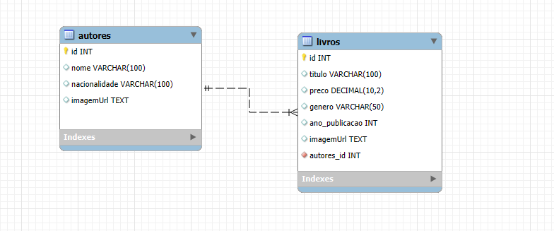

#  Backend - 44Books 

Este é o backend da aplicação **44Books**, uma livraria fictícia com CRUD completo para autores e livros, desenvolvido com **Fastify** e **MySQL**.

##  Tecnologias
- Fastify (framework leve e rápido para Node.js)
- MySQL (banco de dados relacional)
- TypeScript
- @fastify/cors
- mysql2 (driver para Node.js)

## Diagrama do banco de dados



##  Configuração do Banco de Dados

```sql
CREATE DATABASE books44;

USE books44;

CREATE TABLE autores (
  id INT AUTO_INCREMENT PRIMARY KEY,
  nome VARCHAR(100),
  nacionalidade VARCHAR(100),
  imagemUrl TEXT
);

CREATE TABLE livros (
  id INT AUTO_INCREMENT PRIMARY KEY,
  titulo VARCHAR(100),
  preco DECIMAL(10, 2),
  genero VARCHAR(50),
  ano_publicacao INT,
  imagemUrl TEXT,
  autor_id INT,
  FOREIGN KEY (autor_id) REFERENCES autores(id) ON DELETE CASCADE
);

-- Inserção de autores
INSERT INTO autores (id, nome, nacionalidade, imagemUrl) VALUES 
(3, 'Ali Hazelwood', 'Italiana', 'https://alihazelwood.com/wp-content/uploads/2022/01/IMG_3527-scaled.jpeg'),
(4, 'Allison Saft', 'Estadunidense', 'https://t1.bookpage.com/wp-content/uploads/2022/02/25115313/MUG-Allison-Saft-CREDIT-Lisa-DeNeffe_WEB.jpg'),
(7, 'Lynn Painter', 'Estadunidense', 'https://images.gr-assets.com/authors/1577135205p8/19322026.jpg'),
(12, 'Holly Black', 'Estadunidense', 'https://blackholly.com/wp-content/uploads/2014/05/Holly-Black1-683x1024.jpg'),
(14, 'Agatha Christie', 'Britânica', 'https://m.media-amazon.com/images/M/MV5BMTU3OTYzMzY4NV5BMl5BanBnXkFtZTcwMDIxOTIyOA@@._V1_.jpg'),
(23, 'Sophie Kim', 'Estadunidense', 'https://cdn1.booknode.com/author_picture/5366/sophie-kim-5366476-330-540.jpg'),
(25, 'Elayne Baeta', 'Brasileira', 'https://revistabellas.com.br/wp-content/uploads/2024/04/Elayne-Baeta.jpg'),
(29, 'Stephanie Garber', 'Estadunidense', 'https://www.yabookscentral.com/wp-content/uploads/2023/10/AUTHOR-PHOTO_StephanieGarber_c-Etched-in-Time-Photography-scaled.jpg'),
(34, 'Rebecca Ross', 'Estadunidense', 'https://images.gr-assets.com/authors/1655904642p8/14926516.jpg'),
(40, 'Sally Rooney', 'Irlandesa', 'https://thekit.ca/wp-content/uploads/2021/08/2021-sally-thekit.ca-feature-705x849.jpg');


INSERT INTO livros (id, titulo, preco, genero, ano_publicacao, imagemUrl, autor_id) VALUES 
(3, 'Noiva', 59.90, 'Romance', 2024, 'https://m.media-amazon.com/images/I/812RDxFDd8L._SL1500_.jpg', 3),
(4, 'Asas reluzentes', 65.00, 'Romance', 2025, 'https://m.media-amazon.com/images/I/813BWVj4ATL._SL1500_.jpg', 4),
(6, 'Não é como nos filmes', 45.90, 'Romance', 2025, 'https://m.media-amazon.com/images/I/71KrPChpFXL.jpg', 7),
(11, 'O príncipe cruel', 45.00, 'Fantasia', 2018, 'https://m.media-amazon.com/images/I/81FH6q0EqYS.jpg', 12),
(13, 'Morte no Nilo', 35.90, 'Mistério', 2020, 'https://m.media-amazon.com/images/I/71Jt2eJxI6L._UF1000,1000_QL80_.jpg', 14),
(23, 'O deus e a raposa', 79.80, 'Fantasia', 2025, 'https://m.media-amazon.com/images/I/81E-GVkEsrL._UF894,1000_QL80_.jpg', 23),
(25, 'Coisas óbvias sobre o amor', 56.40, 'Romance', 2024, 'https://m.media-amazon.com/images/I/81LMf5x28kL._UF894,1000_QL80_.jpg', 25),
(28, 'Xeque-mate', 44.90, 'Romance', 2024, 'https://m.media-amazon.com/images/I/81O6eWVPaiL.jpg', 3),
(30, 'Um amor problemático de verão', 44.59, 'Romance', 2025, 'https://m.media-amazon.com/images/I/81mxxQTX0wL.jpg', 3),
(32, 'Era uma vez um coração partido', 49.90, 'Fantasia', 2021, 'https://m.media-amazon.com/images/I/91L6DCEfDuL._UF1000,1000_QL80_.jpg', 29),
(34, 'No fundo é amor', 45.40, 'Romance', 2025, 'https://m.media-amazon.com/images/I/81XvsucSLVL.jpg', 3),
(37, 'Não é amor', 45.99, 'Romance', 2025, 'https://m.media-amazon.com/images/I/71i-HM1ZrlL.jpg', 3),
(40, 'Divinos rivais', 36.40, 'Romance', 2024, 'https://m.media-amazon.com/images/I/810NKENMWoL._UF1000,1000_QL80_.jpg', 34),
(43, 'Caraval', 56.40, 'Fantasia', 2023, 'https://m.media-amazon.com/images/I/71p66yY4htL.jpg', 29),
(47, 'Intermezzo', 68.30, 'Drama', 2024, 'https://m.media-amazon.com/images/I/71y3p559-TL.jpg', 40);


```

##  Endpoints da API

### Autores
- `GET /autores` → Lista todos os autores
- `POST /autores` → Adiciona novo autor
- `PUT /autores/:id` → Atualiza um autor
- `DELETE /autores/:id` → Remove autor e seus livros associados

### Livros
- `GET /livros` → Lista todos os livros (com nome do autor)
- `POST /livros` → Adiciona novo livro
- `PUT /livros/:id` → Atualiza um livro
- `DELETE /livros/:id` → Remove um livro

##  CORS
Permissões abertas para requisições de qualquer origem:

```ts
fastify.register(cors, {
  origin: '*',
  methods: ['POST', 'GET', 'DELETE', 'PUT']
});
```

##  Inicialização

1. Instale as dependências:
```bash
npm install
npm install fastify @fastify/cors mysql2 typescript ts-node-dev
```

2. rode o servidor com:
```bash
npm run dev
```

3. Acesse: [http://localhost:8000](http://localhost:8000)

##  Desenvolvedora
**Victória de Almeida Silva**  
Este backend foi criado para gerenciar os dados da aplicação da livraria **44Books**.
---
